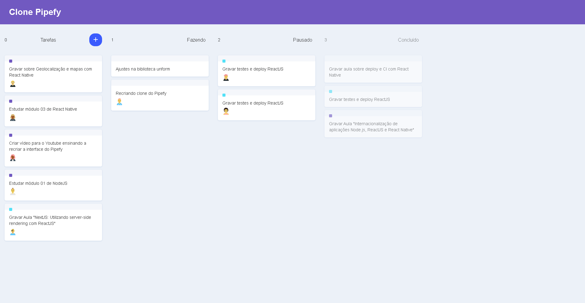

# Clones utilizando(REACT), seguindo tutorial do Youtube

## Pipefy

Youtube: https://www.youtube.com/watch?v=awRtgpRsdTQ&list=PL85ITvJ7FLohTZv9cC5-PrZ39Q3cugWqp&index=15

Usando: Styled-components, Drag n' Drop, React Icons+

## Pipefy

Youtube: https://www.youtube.com/watch?v=VqP1ECc_j4M&list=PL85ITvJ7FLohTZv9cC5-PrZ39Q3cugWqp&index=9

Usando: 

